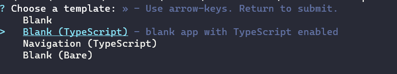
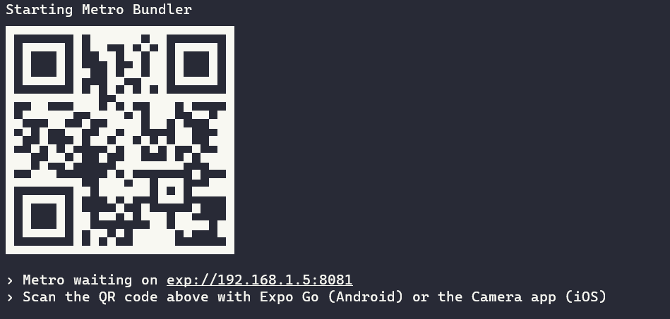
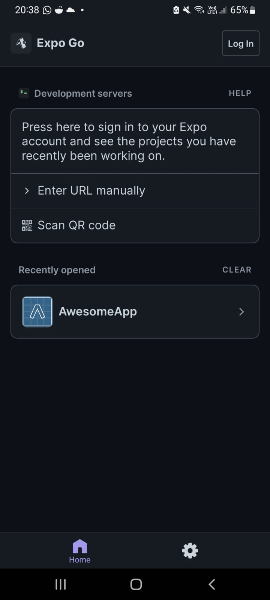
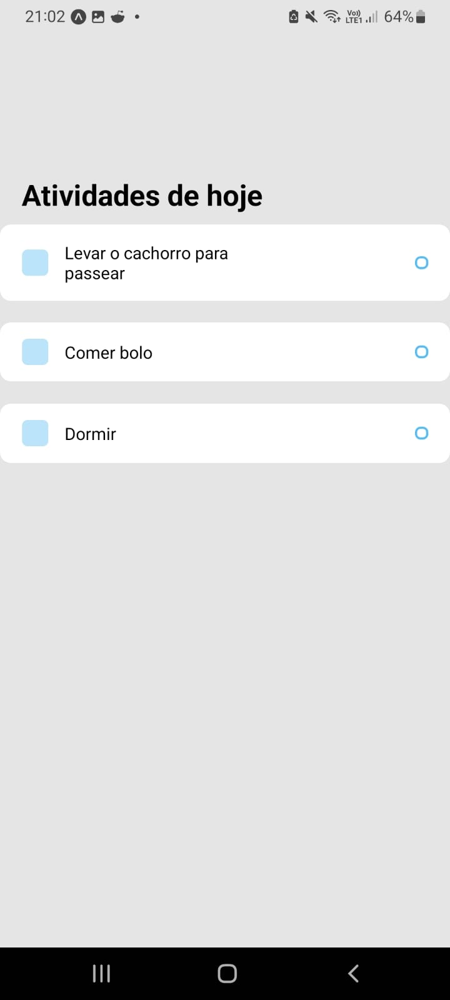

# Criando aplicativos com o React Native

Esse artigo foi escrito para ajudar os alunos interessados a começarem a utilizar o *Framework React Native*.

---

## Súmario

- Pré-requisitos não funcionais
- Pré-requisitos funcionais
- Iniciando uma aplicação React
- Noções básicas de React
    - Corpo da aplicação
    - Modularização
- Refêrencias

---

## Pré-requisitos não funcionais

- Para o Computador
    - Visual Studio Code
    - Node

- Smartphone
    - Expo Go (Android)
    - Camera app (iOS)

---
    
## Pré-requisitos funcionais

- JavaScript
- TypeScript
- HTML
- CSS

---

## Iniciando uma aplicação React

- Crie uma pasta para a sua aplicação no meu caso vou chama-lá de *AwesomeApp*.

- Abra o terminal na pasta e cole o seguinte comando:;
    ```npx create-expo-app --template```
- Selecione a opção **Blank (TypeScript)**
    

- Dê o nome desejado no meu caso vai ser *AwesomeApp*
    

- Entre na pasta usando o comando cd::
    ```cd AwesomeApp```

- Cole agora no terminal o seguinte comando:
    ```npm install -D @tsconfig/react-native @types/jest @types/react @types/react-test-renderer typescript```

- Abra a pasta agora pelo VSCode.
    Caso você tenha o VSCode nas suas variáveis de ambiente abra ele usando```code .```

- procure o arquivo chamado *tsconfig.json* e cole a seguinte configuração dentro dele.
    ```
    {
    "extends": "@tsconfig/react-native/tsconfig.json"
    }
    ```

- Agora no terminal digite:
    ```npx expo start```

- Ele vai iniciar a aplicação e vai te dar um QR code que nem esse.

    

- Abra o Expo Go (Caso o seu telefone for iOS abra o Camera app).
    **Lembrando que o telefone tem que estar na mesma rede que a sua máquina.**

- Clique em *Scan QR code*
    

---

## Noções básicas de React

A aplicação que vamos ver é uma simples **To Do List**.

O React Native ele cria componentes com visuais independentes.

### Corpo da aplicação

O React renderiza a aplicação a partir do arquivo *App.tsx*.


O que importa para a gente nesse momento é a função *App()* que retorna vai renderizar a nossa aplicação.
Dentro dela podemos ver Tags **XML** como *View*, *Text* e *StatusBar*.

As Tags *View* são responsaveis por renderizar estilos que são escritos em *CSS*, seu funcionamento é igual a uma *DIV* do *HTML*, podemos ver esses estilos na constante *styles*.

### Modularização

No corpo da aplicação vou introduizir o seguinte código, caso você queira ver o código sendo feito você pode acessar o link *To Do List em React* nas refêrencias.

```js
import { StatusBar } from 'expo-status-bar';
import { StyleSheet, Text, View } from 'react-native';

export default function App() {
  return (
    <View style={styles.container}>
      {/* titulo */}
      <View style={styles.tasksWrapper} ></View>
        <Text style={styles.sectionTitle} >Atividades de hoje</Text>

        <View style={styles.items}>
          {/* Aqui ficarão as tarefas */}

        </View>

    </View>
  );
}

const styles = StyleSheet.create({
  container: {
    flex: 1,
    backgroundColor: '#e5e5e5',

  },
  tasksWrapper: {
    paddingTop: 80,
    paddingHorizontal: 20,

  },
  sectionTitle: {
    paddingTop: 80,
    paddingHorizontal: 20,
    paddingBottom: 10,
    fontSize: 24,
    fontWeight: 'bold',
  },
  items: {

  },

});

```

- Agora vou criar uma pasta chamada *components* e criar um arquivo chamado *Task.tsx*.

- E vou introduzir o seguinte código nesse arquivo.

```js
import React from 'react';
import { View, Text, StyleSheet } from 'react-native';

const Task = (props) => {
    return (
        <View style={styles.item}>
            <View style={styles.itemLeft} >
                <View style={styles.square}></View>
                <Text style={styles.itemText}>{props.text}</Text>
            </View>
            <View style={styles.circular}></View>

        </View>
    )
}

const styles = StyleSheet.create({
    item: {
        backgroundColor: '#FFF',
        padding: 15,
        borderRadius: 10,
        paddingHorizontal: 20, 
        flexDirection: 'row',
        alignItems: 'center',
        justifyContent: 'space-between', 
        marginBottom: 20,
    },
    itemLeft: {
        flexDirection: 'row',
        alignItems: 'center',
        flexWrap: 'wrap',
    },
    square: {
        width: 24,
        height: 24,
        backgroundColor: '#55BCF6',
        opacity: 0.4,
        borderRadius: 5,
        marginRight: 15,
    },
    itemText: {
        maxWidth: '80%',

    },
    circular: {
        width: 12,
        height: 12,
        borderColor: '#55BCF6',
        borderWidth: 2,
        borderRadius: 5,
    },
});

export default Task;

```

- Agora vou voltar no *App.tsx* e adicionar o seguinte import

```js
import Task from './components/Task';
```

- Agora aonde ficam as tarefas eu posso adicionar os seguintes trechos de código.

```js
    <Task text={'Levar o cachorro para passear'} />
    <Task text={'Comer bolo'} />
    <Task text={'Dormir'} />

```

- Agora se voltarmos no nosso aplicativo teremos algo assim:



---

## Refêrencias

- [Variávies de Ambiente do React Native](https://reactnative.dev/docs/environment-setup)
- [Usando TypeScript com React Native](https://reactnative.dev/docs/typescript)
- [To Do List em React](https://www.youtube.com/watch?v=0kL6nhutjQ8)